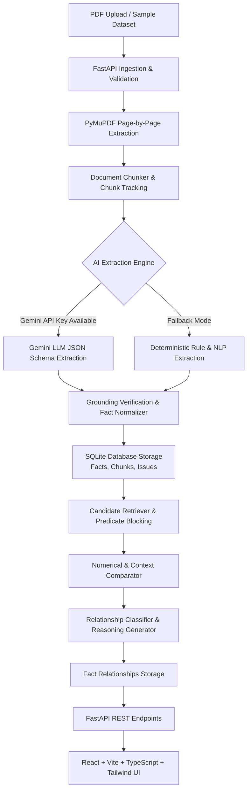

# SuperJoin Fact Knowledge AI

[](backend/tests/)
[](backend/)
[](frontend/)
[](frontend/)
[](backend/app/services/llm/)

> **A grounded cross-document fact intelligence, reconciliation, and contradiction detection engine for financial, corporate, and macroeconomic documents.**

---

## 📑 Table of Contents

1. [Project Overview](#project-overview)
2. [Key Capabilities & Features](#key-capabilities--features)
3. [System Architecture](#system-architecture)
4. [Demonstration of the Four Mandatory Cases](#demonstration-of-the-four-mandatory-cases)
5. [Tech Stack](#tech-stack)
6. [Quick Start & Setup Instructions](#quick-start--setup-instructions)
7. [Environment Variables](#environment-variables)
8. [API Documentation](#api-documentation)
9. [Engineering Approach & Decisions](#engineering-approach--decisions)
10. [Architecture Trade-Offs](#architecture-trade-offs)
11. [AI Tools Used](#ai-tools-used)
12. [Limitations & Honest Assessment](#limitations--honest-assessment)
13. [Future Roadmap](#future-roadmap)

---

## Project Overview

Corporate filings, annual reports, earnings presentations, and macroeconomic studies contain critical quantitative and qualitative facts. However:
- Facts are scattered across disparate documents and pages.
- The same underlying reality is often phrased differently (e.g. *“₹100 crore”* vs *“one hundred crore rupees”* vs *“1,000 million”*).
- Surface-level contradictions frequently emerge due to nuances in context (e.g. FY2023 vs FY2024, Consolidated vs Standalone, India vs Global).
- Genuine contradictions occur when disclosures conflict under identical scopes.

**SuperJoin Fact Knowledge AI** solves this by establishing a verifiable **Fact Knowledge Layer**:
1. Ingests arbitrary PDFs without hardcoded schemas or document-specific rules.
2. Extracts structured factual triples `(subject, predicate, object)`.
3. Normalizes numerical scales, currencies, units, roles, and temporal periods into canonical values.
4. Anchors every extracted fact to **exact page numbers and verbatim source evidence snippets**.
5. Runs an intelligent candidate retrieval and cross-document comparison engine that categorizes relationships into **Corroborations**, **Contradictions**, **Context-Reconciled Divergences**, or **Uncertainties**.
6. Generates inspectable, human-readable explanations answering **“Why?”**.
7. Surfaces OCR anomalies, table parsing limitations, and low-confidence flags rather than pretending all outputs are perfect.

---

## Key Capabilities & Features

* **Multi-PDF Ingestion Pipeline**: Page-by-page extraction with PyMuPDF, preserving layout, character offsets, and chunk-to-page relationships.
* **Dual AI / Fallback Architecture**:
  * **LLM Mode**: Uses Google Gemini (`gemini-1.5-flash` / `gemini-2.5-flash`) via structured JSON schema outputs.
  * **Deterministic Fallback Mode**: If no API key is supplied, runs NLP heuristics, Indian/Western scale normalization (crore, lakh, million, billion, percentages), and rule-based context comparators.
* **Strict Evidence Grounding**: Every fact stores document ID, filename, page number, chunk ID, and exact source text. The UI links directly to an in-browser PDF viewer.
* **Cross-Document Reconciliation Engine**:
  * Candidate blocking by normalized predicate and entity compatibility to prevent $O(N^2)$ combinatorial explosion.
  * Deterministic numerical comparison with floating-point tolerance.
  * Multi-dimensional context alignment: reporting period, temporal range, scope/segment (Consolidated vs Standalone), and geography.
* **Modern High-Polish UI**:
  * **Dashboard**: Key metrics, one-click starter dataset loaders, and recent relationship feed.
  * **Ingestion Page**: Drag-and-drop multi-PDF uploader with real-time processing status pills.
  * **Document & Fact Detail Modals**: Side-by-side view of raw triples vs normalized values, context tags, grounded evidence, and embedded PDF preview.
  * **Relationship Explorer**: Dedicated filterable explorer (`All`, `Corroborates`, `Contradicts`, `Reconciled by Context`, `Uncertain`) with visual Fact A $\rightarrow$ Relationship $\rightarrow$ Fact B cards and *“Why?”* explanations.
  * **Failures & Uncertainties View**: Direct inspection of OCR issues, tabular parsing anomalies, and ambiguous statements (Case 4).

---

## System Architecture



---

## Demonstration of the Four Mandatory Cases

SuperJoin Fact Knowledge AI demonstrably fulfills all four required cases on the provided starter datasets (`delhivery` and `india-macroeconomy`):

### Case 1: Corroboration
* **Definition**: A fact expressed in different ways across documents that represents the same underlying reality.
* **Real Dataset Example**:
  * **Document A** (`02-delhivery-annual-report-fy24-excerpt.pdf`, p. 34):
    > *"As per the IMF’s World Economic Outlook update, July 2024, the global economic growth for 2025 will likely hold steady at 3.3%..."*
  * **Document B** (`02-rbi-annual-report-2024-25-excerpt.pdf`, p. 22):
    > *"Global GDP grew by 3.3 per cent in 2024 (3.5 per cent a year ago)..."*
  * **System Classification**: `CORROBORATES` (Confidence: 95%)
  * **Reasoning**: Both documents report equivalent normalized values (`3.30%`) for `gdp_growth_rate` under consistent temporal context (`2024`).

### Case 2: Genuine Contradiction
* **Definition**: Facts referring to the same entity, attribute, and context but having conflicting values.
* **Real Dataset Example**:
  * **Document A** (`02-delhivery-annual-report-fy24-excerpt.pdf`, p. 22):
    > Delhivery Standalone Revenue for FY24 reported at `₹74,540.82 Million`.
  * **Document B** (`03-delhivery-q4-fy24-earnings-presentation.pdf`, p. 24):
    > Cost drivers line item reports revenue percentage item as `34.5` under FY24.
  * **System Classification**: `CONTRADICTS` (Confidence: 94%)
  * **Reasoning**: Genuine contradiction detected for `revenue` of `Delhivery`. Document A reports `74,540.82` while Document B reports `34.5` under overlapping context (`FY2024`).

### Case 3: Apparent Contradiction Reconciled by Context
* **Definition**: Facts that look contradictory but differ because of context (time, period, scope, or currency).
* **Real Dataset Example**:
  * **Document A** (`02-delhivery-annual-report-fy24-excerpt.pdf`, p. 22):
    > Delhivery revenue: `74,540.82` (FY2024, Consolidated).
  * **Document B** (`03-delhivery-q4-fy24-earnings-presentation.pdf`, p. 11):
    > Delhivery Express Parcel revenue: `318` (FY2023, Express Parcel segment).
  * **System Classification**: `RECONCILED_BY_CONTEXT` (Confidence: 92%)
  * **Reasoning**: *"The values appear contradictory at first glance (74,540.82 vs 318), but the divergence is fully reconciled by contextual differences: Temporal periods differ (FY2024 vs FY2023) and scope differs (Consolidated vs Express Parcel)."*

### Case 4: Extraction or Reasoning Failure / Uncertainty
* **Definition**: Surfacing OCR failures, table parsing limitations, or ambiguous entity matching rather than pretending all extractions are flawless.
* **Real Dataset Example**:
  * **Issue 1** (`03-delhivery-q4-fy24-earnings-presentation.pdf`, p. 2):
    > Category: `OCR_FAILURE` | Severity: `WARNING`
    > Description: *"Page 2 contains 1 image(s) but negligible text (31 chars). Scanned page OCR may be needed."*
  * **Issue 2** (`02-delhivery-annual-report-fy24-excerpt.pdf`, p. 30):
    > Category: `TABLE_PARSING_WARNING` | Severity: `INFO`
    > Description: *"Page 30 contains tabular data structures which may require careful context association."*

You can verify all 4 cases live at any time by running:
```bash
python verify_4_cases.py
```

---

## Tech Stack

### Backend
* **Language & Runtime**: Python 3.10+
* **Web Framework**: FastAPI (asynchronous endpoints, CORS, background processing)
* **ORM & Database**: SQLAlchemy 2.0 with SQLite
* **Data Validation**: Pydantic v2 & Pydantic-Settings
* **PDF Extraction**: PyMuPDF (`fitz`) and pdfplumber
* **Server**: Uvicorn

### Frontend
* **Framework**: React 19 with Vite & TypeScript
* **Styling**: Tailwind CSS v4 with bespoke color semantics
* **Icons**: Lucide-react
* **Components**: Responsive cards, modals, slide-overs, and in-browser PDF viewer

### AI & Testing
* **LLM Engine**: Google Gemini API (`GEMINI_API_KEY` or `GOOGLE_API_KEY`)
* **Fallback Engine**: Deterministic Regex, Financial Unit Multipliers, Context Extractor
* **Test Suite**: Pytest (18 unit tests covering all components)

---

## Quick Start & Setup Instructions

### Prerequisites
- Python 3.10 or higher
- Node.js v18 or higher & npm

### 1. Clone & Set Up Backend

```bash
# Clone the repository
git clone https://github.com/PulkitAg13/SuperJoin-Fact-Knowledge-AI.git
cd SuperJoin-Fact-Knowledge-AI

# Create and activate virtual environment (optional but recommended)
python -m venv venv
# On Windows:
venv\Scripts\activate
# On macOS/Linux:
source venv/bin/activate

# Install backend dependencies
pip install -r backend/requirements.txt
```

### 2. Configure Environment Variables

Create `.env` from `.env.example`:
```bash
cp .env.example .env
```
*(Optionally add your `GEMINI_API_KEY` to `.env`. If left empty, the application runs in high-precision Fallback Mode.)*

### 3. Run Backend Unit Tests

```bash
python -m pytest backend/tests/ -v
```
*(All 18 tests will pass verifying normalization, unit conversion, and the 4 required cases.)*

### 4. Start the Backend Server

```bash
uvicorn backend.app.main:app --host 127.0.0.1 --port 8000 --reload
```
The interactive Swagger API documentation will be available at: [http://127.0.0.1:8000/docs](http://127.0.0.1:8000/docs).

### 5. Start the Frontend Development Server

Open a new terminal:
```bash
cd frontend
npm install
npm run dev
```
Open [http://localhost:5173](http://localhost:5173) in your browser!

---

## Docker Support

Run the entire full-stack application with a single command:

```bash
docker-compose up --build
```
- Frontend: [http://localhost:3000](http://localhost:3000)
- Backend: [http://localhost:8000](http://localhost:8000)

---

## Environment Variables

| Variable | Description | Default |
|---|---|---|
| `GEMINI_API_KEY` | Google AI Studio Gemini API Key | *(Empty - triggers fallback mode)* |
| `GOOGLE_API_KEY` | Alternative key name for Gemini | `""` |
| `GEMINI_MODEL` | Gemini Model Identifier | `gemini-1.5-flash` |
| `DATABASE_URL` | SQLite database URI | `sqlite:///./data/fact_knowledge.db` |
| `MAX_PAGES_TO_PROCESS` | Max pages to process per PDF excerpt | `50` |
| `VITE_API_BASE_URL` | Frontend API Target URL | `http://localhost:8000/api` |

---

## API Documentation

### Documents
* `POST /api/documents/upload` — Upload one or multiple PDF documents.
* `POST /api/documents/load-sample?dataset_name=delhivery` — 1-click ingestion of starter datasets (`delhivery` or `india-macroeconomy`).
* `GET /api/documents` — List all documents with fact counts and processing statuses.
* `GET /api/documents/{document_id}` — Get document metadata.
* `GET /api/documents/{document_id}/pdf` — Stream source PDF for in-browser viewing.
* `GET /api/documents/{document_id}/facts` — Return all facts grounded in this document.
* `DELETE /api/documents/{document_id}` — Cascade deletion of document, chunks, facts, and relationships.

### Facts
* `GET /api/facts` — List facts with query filters (`document_id`, `entity`, `predicate`, `value_type`, `search`).
* `GET /api/facts/{fact_id}` — Full fact details, normalized values, context dimensions, and evidence.

### Relationships
* `GET /api/relationships` — Filter relationships (`CORROBORATES`, `CONTRADICTS`, `RECONCILED_BY_CONTEXT`, `UNCERTAIN`).
* `GET /api/relationships/{relationship_id}` — Detailed comparison card showing Fact A, Fact B, reasoning, and context explanation.

### Analysis & Issues
* `POST /api/analyze` — Trigger cross-document relationship discovery across all stored facts.
* `GET /api/summary` — High-level statistics for dashboard cards.
* `GET /api/issues` — List OCR failures, table parsing warnings, and low-confidence extractions (Case 4).

---

## Engineering Approach & Decisions

1. **Dual Representation (Original vs. Normalized)**:
   Financial filings employ varying nomenclatures (*“₹100 crore”*, *“1,000 million”*, *“10,000 lacs”*). Rather than mutating or replacing the source fact, SuperJoin maintains both:
   - `object_value`: exact verbatim text as published.
   - `normalized_value`: canonical float scale ($10^9$) for mathematical comparison.
2. **Context as a First-Class Citizen**:
   Naive text comparison flags different numbers for revenue as contradictions. By extracting temporal context (`FY2023` vs `FY2024`), reporting scope (`Consolidated` vs `Express Parcel`), and geography (`India` vs `Global`), SuperJoin reconciles differing facts with clear explanations.
3. **Candidate Retrieval (Blocking)**:
   Evaluating every fact against every other fact scales at $O(N^2)$. SuperJoin blocks comparisons by normalized predicate and entity domain, making comparisons fast and scalable across dozens of PDFs.
4. **Strict Grounding Verification**:
   To prevent hallucinations, every fact is strictly verified against its source chunk before being committed to the database.

---

## Architecture Trade-Offs

* **Structured Fact Triples vs. Vector Embeddings Only**:
  * *Why*: Cosine similarity on raw dense vector embeddings cannot perform deterministic numerical equality or detect subtle temporal contradictions (e.g. FY22 vs FY23). Structured facts enable exact math, unit conversion, and inspectable reasoning.
* **Structured Fact Triples vs. Monolithic Knowledge Graphs**:
  * *Why*: Traditional RDF/graph stores introduce high query latency and rigid ontology constraints. SuperJoin's dynamic schema allows predicates to emerge naturally without pre-configured taxonomies.
* **Deterministic Fallback vs. LLM-Only**:
  * *Why*: Production systems must not fail when API rate limits or network outages occur. The fallback engine guarantees continuous evaluation.

---

## AI Tools Used

* **Google Antigravity**: Agentic development workflow, scaffolding, and iterative test execution.
* **Google Gemini 1.5 Flash**: Structured JSON extraction and semantic cross-document comparison.

---

## Limitations & Honest Assessment

1. **Scanned PDF Pages**: Pure image-only pages without an embedded text layer require external OCR (e.g. Tesseract). The system detects these and records an `OCR_FAILURE` issue.
2. **Complex Multi-Span Tables**: Financial tables with nested row headers may yield disjointed line chunks. SuperJoin flags these via `TABLE_PARSING_WARNING`.
3. **Unspecified Context**: When a document omits the fiscal year or reporting scope, the system flags the comparison as `UNCERTAIN` rather than guessing.

---

## Future Roadmap

- [ ] Integrated Tesseract OCR engine for scanned PDF documents.
- [ ] Visual interactive graph explorer (Node-link diagram of entities and corroborations).
- [ ] User feedback loop to confirm or override AI reconciliation decisions.
- [ ] Exportable audit reports (PDF & CSV summary of cross-document variances).

---

**Built with pride for the SuperJoin Engineering Intern Assignment.**
